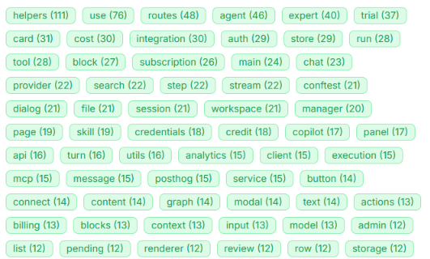
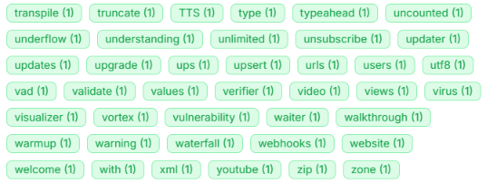
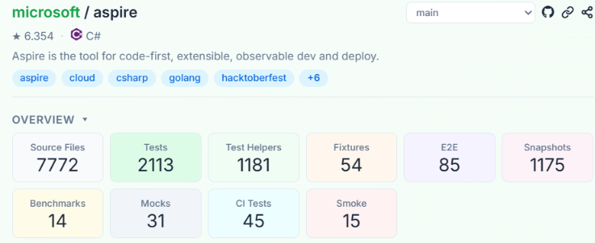

# Explorando Práticas de Teste

Neste exercício, vamos explorar práticas de teste em sistemas reais utilizando a ferramenta [TestMiner](https://andrehora.github.io/testminer).

O TestMiner permite visualizar e analisar testes de software em repositórios do GitHub, fornecendo dados sobre como os projetos organizam seus testes, como eles evoluem entre versões e quais bibliotecas de teste são utilizadas.
Explore a ferramenta antes de começar para se familiarizar com seu funcionamento.

Mais detalhes no GitHub da ferramenta: https://github.com/andrehora/testminer.

---

## Passo 1: Selecionar DOIS repositórios

Escolha dois repositórios reais que possuam testes de software.
Abaixo estão alguns links para ajudá-lo a encontrar projetos interessantes:

- Python: https://github.com/topics/python?l=python
- JavaScript: https://github.com/topics/javascript?l=javascript
- TypeScript: https://github.com/topics/typescript?l=typescript
- Java: https://github.com/topics/java?l=java

- Tópicos: [ai](https://andrehora.github.io/testminer/#topic:ai), [llm](https://andrehora.github.io/testminer/#topic:llm), [api](https://andrehora.github.io/testminer/#topic:api), [nodejs](https://andrehora.github.io/testminer/#topic:nodejs), [android](https://andrehora.github.io/testminer/#topic:android)

- Por organização: [Google](https://andrehora.github.io/testminer/#google), [Microsoft](https://andrehora.github.io/testminer/#microsoft), [Apple](https://andrehora.github.io/testminer/#apple), [Facebook](https://andrehora.github.io/testminer/#facebook), [Netflix](https://andrehora.github.io/testminer/#netflix), 
[GitHub](https://andrehora.github.io/testminer/#github), [Apache](https://andrehora.github.io/testminer/#apache), [HuggingFace](https://andrehora.github.io/testminer/#huggingface)

## Passo 2: Explorar os repositórios selecionados

Busque os repositórios escolhidos no [TestMiner](https://andrehora.github.io/testminer) e analise os dados de teste gerados pela ferramenta.

## Passo 3: Explicar as prática de teste

Para cada repositório, escolha uma prática ou dado de teste relevante e explique com suas próprias palavras.

---

## Instruções de entrega

1. Faça um `fork` deste repositório (saiba mais sobre forks [aqui](https://docs.github.com/pt/pull-requests/collaborating-with-pull-requests/working-with-forks/fork-a-repo)).
2. Responda às questões abaixo diretamente neste arquivo `README.md` do seu fork. Pode adicionar imagens para enriquecer sua explicação.
3. No Moodle, submeta apenas a URL do seu fork.

---

## Respostas

### AutoGPT

Repositório: `https://github.com/Significant-Gravitas/AutoGPT`

URL TestMiner: `https://andrehora.github.io/testminer/#Significant-Gravitas/AutoGPT`

Explicação: O AutoGPT é uma aplicação de IA acessível a todos, com o objetivo principal de desenvolvimento de agentes personalizados para cada usuário. Uma boa prática observada foi a distribuição de testes proporcionalmente à importância da funcionalidade do sistema. Em outras palavras, para classes mais importantes, como agents e experts, mais testes foram implementados, enquanto classes mais simples e menos importantes tiveram menos testes implementados. Podemos observar isso nas figuras abaixo.

<figure>
  
  <figcaption>Classes mais importantes, com maior quantidade de testes.</figcaption>
</figure>

<figure>
  
  <figcaption>Classes menos importantes, com menor quantidade de testes.</figcaption>
</figure>

### aspire

Repositório: `https://github.com/microsoft/aspire`

URL TestMiner: `https://andrehora.github.io/testminer/#microsoft/aspire`

Explicação: A ferramenta identificou cerca de 1200 arquivos de snapshots e 7800 arquivos relacionados a testes, como podemos observar na figura abaixo. Com isso, aproximadamente 1/6 dos testes são destinados à comparação de resultados atuais com os registros anteriores, o que ajuda a identificar alterações indesejadas no comportamento. Assim, essa prática e seu número significativo nesse repositório, podem proporcionar uma maior confiança no desenvolvedor ao fazer alterações no código e reduzir o risco de regressões.

<figure>
  
  <figcaption>Números dos arquivos de testes do repositório aspire.</figcaption>
</figure>